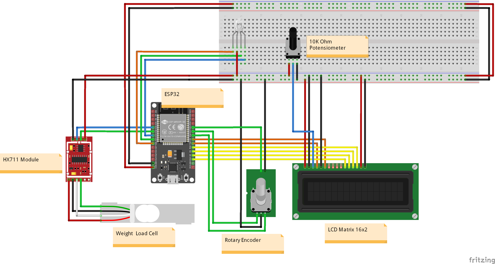

# Laundry Box System
Part of IF4051 Pengembangan Sistem IoT Final Project in Institut Teknologi Bandung 
By : 13516109 Kevin Fernaldy, and 13516141 Ilham Wahabi

### Dependencies
The ESP32 board used in this project is an ESP32 Devkit V1 DOIT board. The code **MAY NOT WORK** with other boards.

The following library is required.
1. [**RotaryEncoder**](https://github.com/mathertel/RotaryEncoder) by mathertel
2. [**EspMQTTClient**](https://github.com/plapointe6/EspMQTTClient) by Patrick Lapointe
3. [**ArduinoJSON**](https://arduinojson.org) by Benoit Blanchon
4. [**Time**](https://github.com/PaulStoffregen/Time) by Paul Stoffregen
5. [**analogWrite**](https://github.com/ERROPiX/ESP32_AnalogWrite) **Polyfill** by ERROPiX
6. [**HX711**](https://github.com/RobTillaart/HX711) by Rob Tillaart

The following additional hardware is required in order to use the full capability of the program.
1. 16x2 LCD Screen 1602A
2. Rotary Encoder
3. **Common Cathode** RGB LED 4-pins
4. 10K Ohm Potensiometer
5. Load Cell (any weight threshold is fine)
6. HX711 Amplifier

ESP32 boards are not natively supported in Arduino. You can install Arduino ESP32 core from Espressif. The instructions can be found in this [repository](https://github.com/espressif/arduino-esp32).

### Hardware Schematic

### Uploading the Code
Before uploading the code, make sure the pin connections follow the schematic above. If you want to use different pinouts, make sure to edit the pin variables inside the code.
1. Open the Arduino IDE and select the ESP32 Devkit V1 DOIT board.
2. Open the esp32_code.ino file in your Arduino IDE.
3. Connect your ESP32 board into your computer.
4. Select the correct COM gate.
5. Upload the code.
